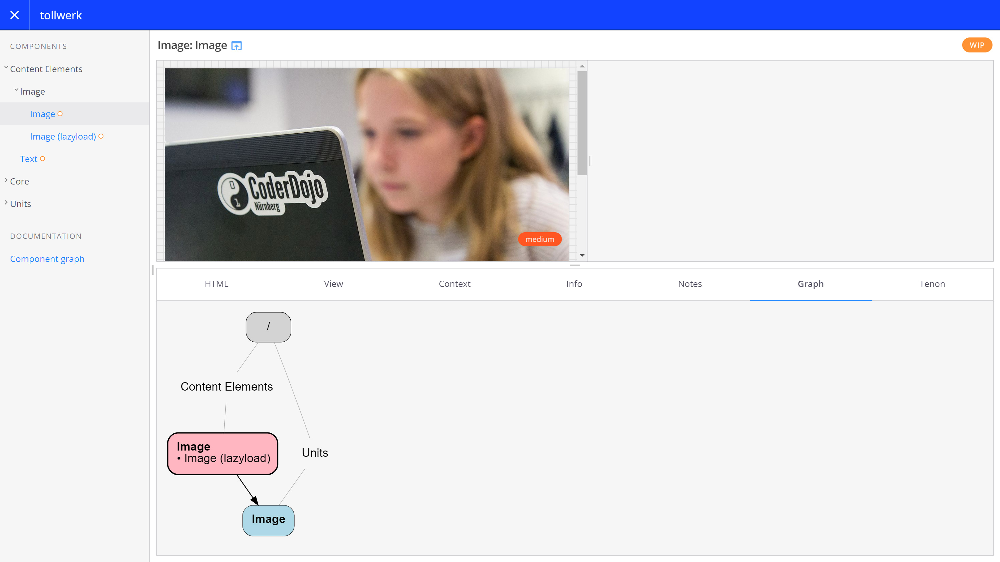

# fractal-typo3 [![NPM version][npm-image]][npm-url] [![NPM downloads][npm-downloads]][npm-url] [![Dependency Status][depstat-image]][depstat-url] [![Development Dependency Status][devdepstat-image]][devdepstat-url]

> TYPO3 bridge for the Fractal component library tool (http://fractal.build / @frctl)

About
-----

This [Fractal](http://fractal.build/) plugin lets you use the Open Source CMS [TYPO3](https://typo3.org/) as source of and template engine for your web component library. It is the counterpart to the [TYPO3 component library extension](https://github.com/tollwerk/TYPO3-ext-tw_componentlibrary).


Usage
-----

### Installation

To add TYPO3 support to your Fractal instance, run

```bash
npm install --save fractal-typo3
```

in your project root directory. Also, make sure you installed and enabled the [TYPO3 component library extension](https://github.com/tollwerk/TYPO3-ext-tw_componentlibrary) in your TYPO3 instance.

### Configuration

To enable TYPO3 as component source and template engine, add these settings to your [`fractal.js`](http://fractal.build/guide/project-settings) configuration:

```js
const path = require('path');
const fractal = module.exports = require('@frctl/fractal').create();
const typo3 = require('fractal-typo3');

// Configure the absolute URL of your TYPO3 frontend
typo3.configure('web', 'http://example.com');

// Configure Fractal's component base directory
fractal.components.set('path', path.join(__dirname, 'fractal', 'components'));

// Set the directory for static assets to your TYPO3 root directory
fractal.web.set('static.path', path.join(__dirname, 'web'));

// Configure Fractal to use TYPO3 as template engine
fractal.components.engine(typo3.engine);
fractal.components.set('ext', '.t3s');

// Register the 'update-typo3' custom command
fractal.cli.command('update-typo3', typo3.update, {
    description: 'Synchronise components with TYPO3'
});
```

Make sure that your server knows how to resolve the absolute URL to your TYPO3 frontend. You might need to add an entry to your [hosts](https://en.wikipedia.org/wiki/Hosts_(file)) file for this to work under certain circumstances.

### Component dependency graphs

If you have [GraphViz](http://www.graphviz.org/) available on your server, you can enable an additional Fractal panel that will give you a dynamically created dependency graph for each component:



To enable the "Graph" panel in Fractal, edit your `fractal.js` and pass a Fractal theme instance as third argument to the configuration method:

```js
const path = require('path');
const fractal = module.exports = require('@frctl/fractal').create();
const typo3 = require('fractal-typo3');

// Create a custom theme and pass it to the configuration method
const typo3Theme = require('@frctl/mandelbrot')();
typo3.configure('web', 'http://example.com', typo3Theme);

/* ... */
````

### Component update with TYPO3

Run the following command to synchronise with TYPO3 and build your component library:

```bash
fractal update-typo3
```

You should see a list of components that are created / updated during synchronisation:

```bash
√ Generic/Hero
√ Generic/Collapsible
√ Generic/Definition List
√ Generic/Menu/Button
√ Generic/Menu/Breadcrumb
√ Generic/Menu/Main
...
```

Please restart your Fractal server in case the Web UI doesn't reflect the changes automatically. After refresh, your TYPO3 components should show up in Fractal:


Instead of displaying pre-rendered results, Fractal uses TYPO3 as real-time template engine for rendering your TYPO3 components on demand, hence the short rendering delay.

Contributing
------------

Found a bug or have a feature request? [Please have a look at the known issues](https://github.com/tollwerk/fractal-typo3/issues) first and open a new issue if necessary. Please see [contributing](CONTRIBUTING.md) and [conduct](CONDUCT.md) for details.

Security
--------

If you discover any security related issues, please email joschi@kuphal.net instead of using the issue tracker.

Credits
-------

- [Joschi Kuphal][author-url]
- [All Contributors](../../contributors)

License
-------

Copyright © 2017 [Joschi Kuphal][author-url] / joschi@kuphal.net. Licensed under the terms of the [MIT license](LICENSE.txt).

[author-url]: https://tollwerk.is
[npm-url]: https://npmjs.org/package/fractal-typo3
[npm-image]: https://badge.fury.io/js/fractal-typo3.svg
[npm-downloads]: https://img.shields.io/npm/dm/fractal-typo3.svg

[travis-url]: http://travis-ci.org/tollwerk/fractal-typo3
[travis-image]: https://secure.travis-ci.org/tollwerk/fractal-typo3.svg

[coveralls-url]: https://coveralls.io/r/tollwerk/fractal-typo3
[coveralls-image]: https://img.shields.io/coveralls/tollwerk/fractal-typo3.svg

[depstat-url]: https://david-dm.org/tollwerk/fractal-typo3#info=dependencies
[depstat-image]: https://david-dm.org/tollwerk/fractal-typo3.svg
[devdepstat-url]: https://david-dm.org/tollwerk/fractal-typo3#info=devDependencies
[devdepstat-image]: https://david-dm.org/tollwerk/fractal-typo3/dev-status.svg
